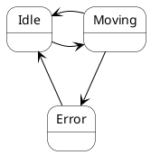
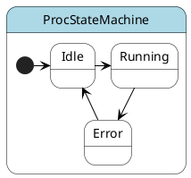
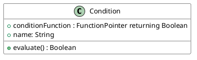
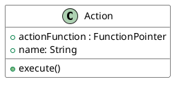
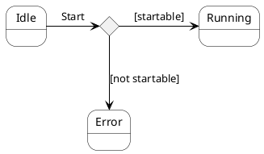
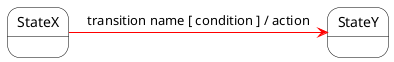
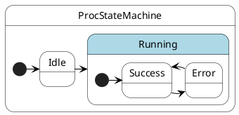
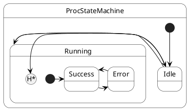

# State-Machine

- [State-Machine](#state-machine)
  - [Description](#description)
  - [Major difference to workflow-engine](#major-difference-to-workflow-engine)
  - [Hints and Tips](#hints-and-tips)
  - [FAQ](#faq)
    - [When it’s a State Entry Action and when it's a Transition Action?](#when-its-a-state-entry-action-and-when-its-a-transition-action)
    - [Is it possible to change the state of a state-machine beside the ```trigger()``` function?](#is-it-possible-to-change-the-state-of-a-state-machine-beside-the-trigger-function)
    - [Is it allowed to change the state-machine setup after the statemachine has started?](#is-it-allowed-to-change-the-state-machine-setup-after-the-statemachine-has-started)
  - [Framework](#framework)
    - [Statemachine](#statemachine)
    - [Condition](#condition)
    - [Action](#action)
    - [State](#state)
    - [Choice](#choice)
    - [Transition](#transition)
    - [Sub-state-machine](#sub-state-machine)
  - [Elements not Implemented](#elements-not-implemented)
    - [History/DeepHistroy state](#historydeephistroy-state)
    - [Triggerless Transitions](#triggerless-transitions)
    - [Transition from sub-state](#transition-from-sub-state)
    - [Final-State, counterpart of Initial-State](#final-state-counterpart-of-initial-state)
    - [State Do-Action](#state-do-action)
    - [Multithreading and background-thread execution](#multithreading-and-background-thread-execution)

## Description

State machines are used to model the dynamic behavior of a model element, and more specifically, the event-driven aspects of the system's behavior. State machines are specifically used to define state-dependent behavior, or behavior that varies depending on the state in which the model element is in. 
Model elements whose behavior does not vary with its state of the element do not require state machines to describe their behavior (these elements are typically passive classes whose primary responsible is to manage data).

A state machine consists of states, linked by transitions. A state is a condition of an object in which it performs some activity or waits for an event.

A transition is a relationship between two states which is triggered by some event, which performs certain actions or evaluations, and which results in a specific end-state.

In the context of the state machine, an event is an occurrence of a stimulus that can trigger a state transition.
A condition is evaluated after the trigger event for the transition occurs.
An action is an executable atomic computation, meaning that it cannot be interrupted by an event and therefore runs to completion. 

Entry and exit actions allow the same action to be executed every time the state is entered or left.

A simple state is one which has no substructure. A state which has substates (sub-state-machine) is called a composite state. A nested state machine may have at most one initial state. Sub-state-machines are used to simplify complex flat state-machines by showing that some states are only possible within a particular context (the enclosing state).

## Major difference to workflow-engine
In general, the major difference between a workflow engine and a state machine lies in focus. In a workflow engine, transition to the next step occurs when a previous action is completed, whilst a state machine needs an external event that will cause branching to the next activity. In other words, state machine is event driven and workflow engine is not.

Workflow engine supports sequential pattern when tasks are executed one after another. The next step in a workflow will not start till the previous is finished. For instance, the document will not be signed by the boss till the lawyer signs it. As a result, workflow engine seems to be rigid and deterministic in its nature. State machine, on the contrary, works asynchronously. Since the steps in the machine are triggered by certain events/actions, they shouldn't necessarily be performed in a strict order. From this point of view state machines are more flexible.

## Hints and Tips

* Name states according to what you are waiting for or what is happening during the state. Remember that a state is not a 'point in time'; it's a period during which the state machine is waiting for something to happen. For example, 'waitingForEnd' is a better name than 'end'; 'timingSomeActivity' is better than 'timeout'.
* Avoid using space-character [\s] for names; The generated plantUML output might not work anymore.
* Name all states and transitions within a state machine uniquely; this will make source-level debugging easier.
* If there are more than 8 ± 2 states on a single diagram, consider using substates. Common sense applies: ten states in an absolutely regular pattern might be fine, but two states with forty transitions between them obviously needs to be re-thought. Make sure the state machine is understandable.
* Exit actions can be used to provide safety features, e.g. the exit action from the 'heaterOn' state turns the heater off, where the actions are used to enforce an assertion.
* Generally substates should contain two or more states
* Choice points should be used instead of conditional logic in actions or transitions. Choice point are easily seen, whereas conditional logic in code is hidden from view and easy to overlook.
* Avoid state machines which resemble flow-charts/workflows
  * This may indicate an attempt to model an abstraction that is not really there, such as:
    * using an active class to model behavior that is best suited for a passive (or data) class or
    * modeling a data class by using a data class and an active class that are very tightly coupled (i.e. the data class was used for passing type information around but the active class contains most of the data that should be associated with the data class).
  * This misuse of state machines can be recognized by the following symptoms:
    * messages sent to 'self', primarily just to re-use code
    * few states, with many choice points
    * in some cases a state machine without cycles. Such state machines are valid in process control applications or when trying to control a sequence of events; their presence during analysis usually represents the degeneration of the state machine into a flow-chart/workflow.
  * When the problem is identified:
    * Consider splitting the active class into smaller units with more distinct responsibilities.

## FAQ
### When it’s a State Entry Action and when it's a Transition Action?
If you want to design a behavior where the function takes a lot of time. use a state.

```plantuml
@startuml
skinparam state {
  BackgroundColor White
  BorderColor Black
  ArrowColor Black
}
state Idle
state Moving
Idle -right-> Moving 
Moving -left-> Idle
```


If you want to design a behavior where the function might fail, use a state. Especially if you also want to express how to recover from the failure state.


Use Transitions Actions if the function behind doesn’t influence the next state of the state-machine. The problem is, if a Transition-Action leads to an error the next state will execute the entry-action anyway and this is really bad in some cases. Someone could argue “but then the implementer could check whether an entry-action is allowed to execute”, with other words having a state-machine to check the state-machine; bad smell.

Imagine a Transition (and therefore the action too) is infinitely short from the business perspective.

### Is it possible to change the state of a state-machine beside the ```trigger()``` function?
No, this indicates a bad smell of the current state-machine. Redesign your state-machine for all possible cases.

### Is it allowed to change the state-machine setup after the statemachine has started?
No, this would lead to a big mess, because then you couldn't reconstruct any behavior anymore.

## Framework

The state machine framework implements (partialy) the [UML state machine](https://en.wikipedia.org/wiki/UML_state_machine). It follows the UML standard as mutch as possible.

Currently following elements are implemented:

### Statemachine
Statemachine glues the elements together and its the executing instance


### Condition
A Condition whre a user-function must be set which is returning a boolean value


### Action
An Action where a user-function must be set


### State
A State with optional entry and/or exit action

```plantuml
@startuml
skinparam backgroundColor White
skinparam state {
  BackgroundColor<<CURRENT>> LightBlue
  BackgroundColor White
  BorderColor Black
  ArrowColor Black
}
state MyState <<CURRENT>>
MyState : + entry: AnAction
MyState : + exit: AnotherAction
@enduml
```


### Choice
A Choice-element containing a condition and where is to setup a target-state for a true- and false-path


### Transition
A Transition with optional condition, optional action and connectable with a target-state or choice-element



### Sub-state-machine
A Sub-state-machine can be setup in a State

## Elements not Implemented
Following elements not implemented yet

### History/DeepHistroy state

### Triggerless Transitions
But Avoid guard conditions or triggerless Transitions.
If the event triggers several transitions, there is no control over which guard condition is evaluated first. As a result, results can be unpredictable.
More than one guard condition could be 'true', but only one transition can be followed. The path chosen can be unpredictable.
Guard conditions are non-visual; it is harder to 'see' their presence.
### Transition from sub-state
### Final-State, counterpart of Initial-State
### State Do-Action
### Multithreading and background-thread execution
